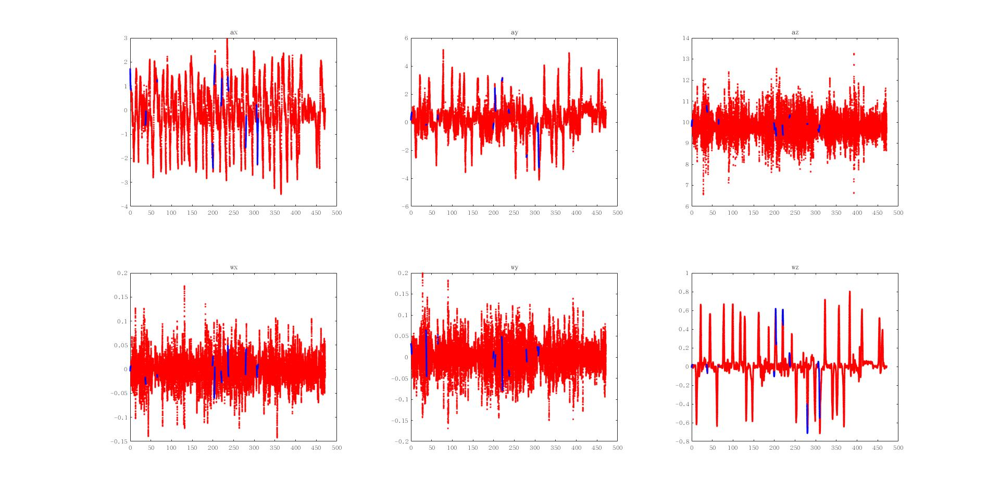
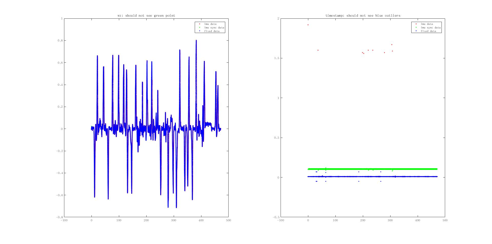
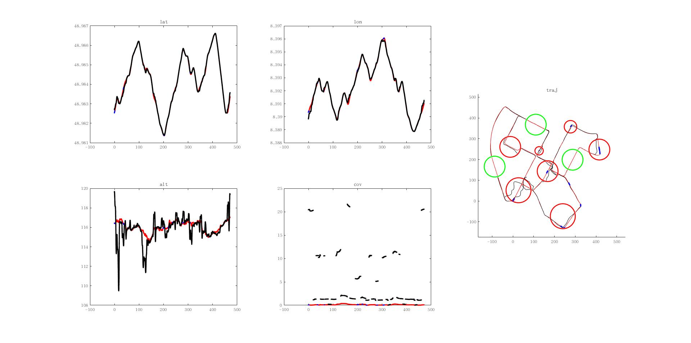

# A Interpolation and Noise Tool for KITTI Raw Data

This tool

- Interpolate and re-sync IMU data to give KITTI a 100 Hz IMU and GNSS data and correct the timestamp with vision image.

- Allow user to add noise and bias to GNSS data in given area.

The main entrance is  `ProcessKITTI.m`. 

## Input

This tool uses vision image along with its timestamps from **synced+rectified data**(like [this](https://s3.eu-central-1.amazonaws.com/avg-kitti/raw_data/2011_10_03_drive_0027/2011_10_03_drive_0027_sync.zip)), then align, interpolate and noise the IMU and GNSS data form the **unsynced+unrectified data**(like [this](https://s3.eu-central-1.amazonaws.com/avg-kitti/raw_data/2011_10_03_drive_0027/2011_10_03_drive_0027_extract.zip)).  Therefore, the tool require two folders contain these two set of data, please make your KITTI folder organized like:

`<KITTI_Folder>`

├──  `<Synced_RawData_Folder>`

│   └── `<Set_Folder>`

│       	└── `<SubSet_Folder>`

└──  `<UnSynced_RawData_Folder>`

​    └── `<Set_Folder>`

​        	└── `<SubSet_Folder>`

These paths can be changed in `ProcessKITTI.m `and `ReadData.m`.

For example, on my system,

/media/joey/dataset/KITTI		#`<KITTI_Folder>`

├── RawData							 #`<Synced_RawData_Folder>`
│   ├── 2011_09_26
│   └── 2011_10_03					#`<Set_Folder>`
│       	├── 2011_10_03_drive_0027_sync	#`<SubSet_Folder>`
│       	├── 2011_10_03_drive_0034_sync
│       	├── 2011_10_03_drive_0042_sync
│       	├── 2011_10_03_drive_0047_sync
│       	├── 2011_10_03_drive_0058_sync
│       	├── calib_cam_to_cam.txt
│       	├── calib_imu_to_velo.txt
│       	└── calib_velo_to_cam.txt

└── RawDataUnsync			# `<UnSynced_RawData_Folder>`
    ├── 2011_09_26
	└── 2011_10_03
        	├── 2011_10_03_drive_0027_extract
        	├── calib_cam_to_cam.txt
        	├── calib_imu_to_velo.txt
        	├── calib.mat
        	└── calib_velo_to_cam.txt

## Output

This tool will create a path called `RawDataFixed `under `<KITTI_Folder>`, with the regular KITTI set name and sub set name. The OXTS data ( which contain IMU and GNSS) is written 3 times in to three folders: `oxts-fixed`,`oxts-interped`and `oxts-noised`. 

- `oxts-fixed`: oxts data with timestamp and IMU data interpolated. Rest of the data is filled with `NaN`.
- `oxts-interped`: oxts data with timestamp, IMU and GNSS data interpolated.
- `oxts-noised`: oxts data with timestamp, IMU and GNSS data interpolated. Extra artificial noise is add to GNSS.

**You should copy the image data (image_00 and image_01) from the synced data set manually .**

## Processing 

### Read data

In `ReadData.m`.

Due to the KITTI's file arrangement, the reading (as well as writing) can be really slow, so be patient.

### Interpolate IMU data

In `InterpImu.m`.

The result will show two pics. Please do visual check on the interp result (blue).

and the visual check on the time interp result as instructed in the figure title:

### Interpolate and noise GNSS data

In `InterpAndNoiseGnss.m`.

Please tweak the parameters on the top of `InterpAndNoiseGnss.m`， where `bad_gnss_area`defines the artificial-defined bad gnss area, with [ x y z radius]. The x-y-z here is under local ENU, you can determine it on the given figure after the first run.

The result will show one pic. Please do visual check on the interp and  result (black). The red circle is the bad gnss area.

